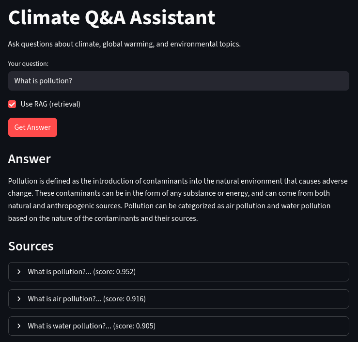
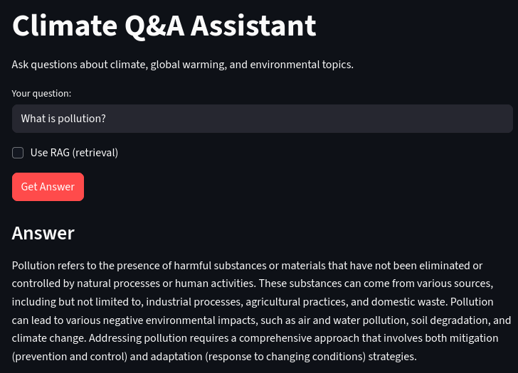

# Climate Q&A Assistant

RAG-чатбот для ответов на вопросы о климатологии и окружающей среде.

>**Важно**: Для лучших результатов используйте английский.


## Возможности

- **RAG (Retrieval-Augmented Generation)**: Семантический поиск + генерация для точных ответов
- **E5 эмбеддинги**: Быстрый поиск с моделью [intfloat/e5-small-v2](https://huggingface.co/intfloat/e5-small-v2)
- **Qwen LLM**: Квантованная модель [Qwen 0.5B](https://huggingface.co/Qwen/Qwen2.5-0.5B-Instruct-GGUF) для генерации
- **Streamlit UI**: Веб-интерфейс для взаимодействия
- **Логирование**: Все диалоги сохраняются в JSONL
- **Docker**: Развёртывание через Docker Compose

## Архитектура

```
Вопрос пользователя о климате
    ↓
E5 эмбеддинги (семантический поиск)
    ↓
Top-3 релевантные статьи из базы
    ↓
Qwen генератор (с контекстом)
    ↓
Ответ + источники
```

## Датасет

- **Источник**: [pierre-pessarossi/climate-question-answers](https://huggingface.co/datasets/pierre-pessarossi/climate-question-answers)
- **Размер**: ~2000+ пар вопрос-ответ
- **Темы**: климат, глобальное потепление, экосистемы, возобновляемая энергия
- **Формат**: Parquet (HuggingFace Hub)
- **Язык**: Английский

## Технологии

- **Эмбеддинги**: `sentence-transformers` ([E5-small-v2](https://huggingface.co/intfloat/e5-small-v2), ~130 МБ)
- **LLM**: `llama-cpp-python` с [Qwen 0.5B GGUF](https://huggingface.co/Qwen/Qwen2.5-0.5B-Instruct-GGUF) (~500 МБ)
- **UI**: Streamlit
- **Libraries/Frameworks**: Pandas, PyTorch, HuggingFaceHub
- **Развёртывание**: Docker, Docker Compose
- **Управление зависимостями**: uv

## Установка

### Локальная установка

```bash
# Установка зависимостей
uv sync

# Запуск Streamlit приложения
uv run streamlit run app.py
```

Приложение будет доступно по адресу `http://localhost:8501`

### Установка через Docker

```bash
# Сборка и запуск
docker-compose up -d

# Доступ к приложению
# http://localhost:8501
```

**Первый запуск**:

- Установка зависимостей (`uv sync`) включает PyTorch и llama-cpp-python, которые требуют компиляции/скачивания (~1-5 минут)
- При первом запуске приложения будут загружены модели E5 (~130 МБ) и Qwen (~500 МБ) из HuggingFace
- Общее время первого запуска: 5-15 минут (в зависимости от интернета и ПК)
- Модели кэшируются для последующих запусков (намного быстрее)

## Структура проекта

```
mental-helper/
├── app.py                      # Streamlit интерфейс
├── src/
│   ├── rag_pipeline.py         # RAG поиск и получение релевантных документов
│   └── generator.py            # Обёртка над Qwen для генерации ответов
├── data/
│   ├── qa_dataset.json         # 172 пары вопрос-ответ
│   └── e5_index.pt             # Предвычисленные эмбеддинги
├── app.ipynb                   # Интерактивный ноутбук для тестирования
├── notebooks/
│   ├── preprocess_data.ipynb   # Парсинг данных из HuggingFace
│   ├── rag.ipynb               # Тестирование RAG
│   ├── chat.ipynb              # Тестирование генерации
│   └── evaluation.ipynb        # Оценка метрик
├── logs/
│   └── chat_logs.jsonl         # Логи диалогов
├── assets/
│   └── ...          # Скриншоты интерфейса
├── Dockerfile
├── docker-compose.yml
└── pyproject.toml
```

## Результаты оценки

Тестирование RAG vs Baseline на климатических вопросах (20 samples):

| Метрика  | RAG    | Baseline | Улучшение |
|----------|--------|----------|-----------|
| ROUGE-1  | 0.5722 | 0.2426   | +136%     |
| ROUGE-2  | 0.4982 | 0.0964   | +417%     |
| ROUGE-L  | 0.5372 | 0.1764   | +205%     |
| BLEU     | 0.3314 | 0.0416   | +697%     |

**Вывод**: RAG показывает **2-7x улучшение** над baseline, особенно на BLEU метрике (+697%).

### Метрики

- **ROUGE-1**: Совпадение слов
- **ROUGE-2**: Совпадение пар слов
- **ROUGE-L**: Наибольшая общая подпоследовательность
- **BLEU**: Точность фраз

## Использование

### Веб-интерфейс

1. Введите вопрос по климате в поле "Your question"
   - **Английский язык рекомендуется** для лучших результатов
   - Примеры: "What is climate change?", "How do greenhouse gases work?"

2. Переключатель "Use RAG (retrieval)":
   - ✅ Включено: использует релевантные статьи из базы
   - ❌ Выключено: генерация без контекста

3. Нажмите "Get Answer"

4. Просмотрите:
   - Ответ с подробностями
   - Источники (при RAG) с показателем релевантности (0-1)

### Примеры работы

#### С RAG (Retrieval-Augmented Generation)
Использует семантический поиск по базе знаний для получения актуального контекста:



**Преимущества**:
- Ответы основаны на реальных источниках из базы
- Показывает релевантные документы
- Более точные и научные ответы

#### Без RAG (Baseline)
Генерация ответа без контекста из базы знаний:



**Характеристики**:
- Генерация основана только на обучении модели
- Нет ссылок на источники
- Менее точные результаты (см. метрики выше)

### Логирование

Все взаимодействия автоматически сохраняются в `logs/chat_logs.jsonl`:

```json
{
  "timestamp": "2025-12-02T17:45:12",
  "query": "How to manage anxiety?",
  "answer": "1. Practice deep breathing...",
  "rag_enabled": true,
  "sources": [
    {"question": "How to manage stress?", "score": 0.930}
  ]
}
```

## Производительность

- **Поиск релевантных документов**: <100 мс (CPU)
- **Генерация ответа**: ~2-5 секунд (CPU, 128 токенов)
- **Размер моделей**: ~630 МБ (E5 + Qwen)
- **Использование RAM**: ~2 ГБ

## Разработка

### Тестирование

Запустить ноутбук `app.ipynb`

Используйте функцию `answer(query, rag_enabled=True)` для тестирования:

- `rag_enabled=True` — с контекстом из базы знаний
- `rag_enabled=False` — baseline (без RAG)

### Docker команды

```bash
# Просмотр логов
docker-compose logs -f

# Остановка
docker-compose down

# Перезапуск после изменений кода
docker-compose down && docker-compose up -d --build

# Очистка volumes (удалит кэш моделей)
docker-compose down -v
```

## Как это работает

### 1. Загрузка данных
- Датасет из HuggingFace (pierre-pessarossi/climate-question-answers)
- Парсинг вопросов и ответов о климате
- Сохранение в `qa_dataset.json` (~2000 пар)

### 2. Индексация
- Кодирование всех вопросов через E5-small-v2
- Эмбеддинги сохраняются в `e5_index.pt`
- Предвычисляются один раз для быстрого инференса

### 3. Поиск (Retrieval)
- Запрос пользователя кодируется через E5
- Вычисляется косинусное сходство
- Возвращаются top-3 релевантные статьи

### 4. Генерация (Generation)
- Контекст из найденных статей добавляется в промпт
- Qwen генерирует развернутый научный ответ
- Ответ всегда базируется на достоверных источниках

### 5. Логирование
- Каждый диалог записывается в `logs/chat_logs.jsonl`
- Сохраняет: время, вопрос, ответ, источники

## Важные замечания
### Ограничения

- **Английский язык даст лучшие результаты**
- База знаний содержит ~2000 пар вопрос-ответ
- Данные замерзают на дату обучения датасета
- Не заменяет научные источники
