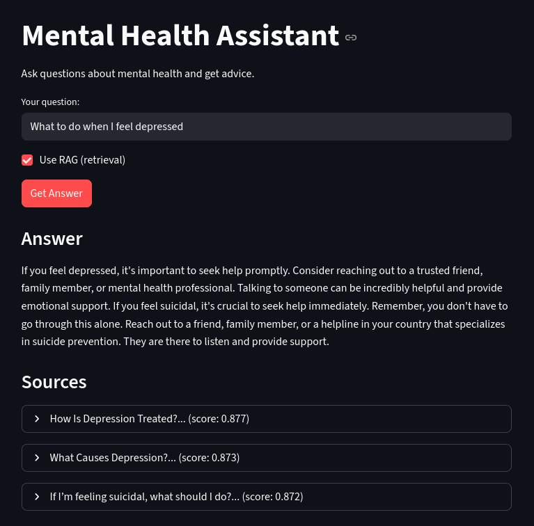

# Mental Health Assistant

RAG-чатбот для поддержки по вопросам психического здоровья.

>**Важно**: Модель обучена на английском языке и работает значительно качественнее с запросами на английском. Для лучших результатов формулируйте вопросы на английском языке.



## Возможности

- **RAG (Retrieval-Augmented Generation)**: Комбинирует семантический поиск с генерацией ответов для повышения точности
- **E5 эмбеддинги**: Быстрый семантический поиск с использованием модели [intfloat/e5-small-v2](https://huggingface.co/intfloat/e5-small-v2)
- **Qwen LLM**: Лёгкая квантованная модель ([Qwen 0.5B](https://huggingface.co/Qwen/Qwen2.5-0.5B-Instruct-GGUF)) для генерации ответов
- **Интерактивный веб-интерфейс**: Streamlit UI для взаимодействия с чатботом
- **Логирование диалогов**: Все взаимодействия сохраняются в формате JSONL
- **Docker поддержка**: Простое развёртывание через Docker Compose

## Архитектура

```
Запрос пользователя
    ↓
E5 эмбеддинги (семантический поиск)
    ↓
Top-K релевантные документы (3 из 172)
    ↓
Qwen генератор (с контекстом)
    ↓
Сгенерированный ответ + источники
```

## Датасет

- **Источник**: [heliosbrahma/mental_health_chatbot_dataset](https://huggingface.co/datasets/heliosbrahma/mental_health_chatbot_dataset)
- **Размер**: 172 пары вопрос-ответ
- **Темы**: тревожность, депрессия, панические атаки, управление стрессом, определения в области психического здоровья
- **Формат**: `data/qa_dataset.json`
- **Язык**: Английский

## Технологии

- **Эмбеддинги**: `sentence-transformers` ([E5-small-v2](https://huggingface.co/intfloat/e5-small-v2), ~130 МБ)
- **LLM**: `llama-cpp-python` с [Qwen 0.5B GGUF](https://huggingface.co/Qwen/Qwen2.5-0.5B-Instruct-GGUF) (~500 МБ)
- **UI**: Streamlit
- **Libraries/Frameworks**: Pandas, PyTorch, HuggingFaceHub
- **Развёртывание**: Docker, Docker Compose
- **Управление зависимостями**: uv

## Установка

### Локальная установка

```bash
# Установка зависимостей
uv sync

# Запуск Streamlit приложения
uv run streamlit run app.py
```

Приложение будет доступно по адресу `http://localhost:8501`

### Установка через Docker

```bash
# Сборка и запуск
docker-compose up -d

# Доступ к приложению
# http://localhost:8501
```

**Первый запуск**:

- Установка зависимостей (`uv sync`) включает PyTorch и llama-cpp-python, которые требуют компиляции/скачивания (~1-5 минут)
- При первом запуске приложения будут загружены модели E5 (~130 МБ) и Qwen (~500 МБ) из HuggingFace
- Общее время первого запуска: 5-15 минут (в зависимости от интернета и ПК)
- Модели кэшируются для последующих запусков (намного быстрее)

## Структура проекта

```
mental-helper/
├── app.py                      # Streamlit интерфейс
├── src/
│   ├── rag_pipeline.py         # RAG поиск и получение релевантных документов
│   └── generator.py            # Обёртка над Qwen для генерации ответов
├── data/
│   ├── qa_dataset.json         # 172 пары вопрос-ответ
│   └── e5_index.pt             # Предвычисленные эмбеддинги
├── notebooks/
│   ├── preprocess_data.ipynb   # Парсинг данных из HuggingFace
│   ├── rag.ipynb               # Тестирование RAG
│   ├── chat.ipynb              # Тестирование генерации
│   └── evaluation.ipynb        # Оценка метрик
├── logs/
│   └── chat_logs.jsonl         # Логи диалогов
├── assets/
│   └── example.jpg             # Скриншот интерфейса
├── Dockerfile
├── docker-compose.yml
└── pyproject.toml
```

## Результаты оценки

Сравнение RAG vs Baseline на 10 тестовых примерах:

| Метрика  | RAG    | Baseline (без RAG) | Улучшение |
|----------|--------|-------------------|-----------|
| ROUGE-1  | 0.4914 | 0.3189            | +54%      |
| ROUGE-2  | 0.3240 | 0.0877            | +269%     |
| ROUGE-L  | 0.3733 | 0.1773            | +110%     |
| BLEU     | 0.1466 | 0.0412            | +256%     |

**Вывод**: RAG улучшает качество ответов в **2.5-3.5 раза** по всем метрикам.

### Интерпретация метрик

- **ROUGE-1**: Совпадение отдельных слов (unigram overlap)
- **ROUGE-2**: Совпадение биграмм (последовательности из 2 слов)
- **ROUGE-L**: Самая длинная общая подпоследовательность
- **BLEU**: Точность n-грамм с учётом порядка

## Использование

### Веб-интерфейс

1. Введите вопрос по психическому здоровью в поле "Your question"
   - **Рекомендуется использовать английский язык** для лучших результатов
   - Пример: "How to cope with stress?"

2. Переключатель "Use RAG (retrieval)":
   - ✅ Включено: использует контекст из базы знаний
   - ❌ Выключено: генерация без контекста (baseline)

3. Нажмите "Get Answer" для получения ответа

4. Просмотрите:
   - Сгенерированный ответ
   - Источники (при включённом RAG) с показателем релевантности

### Логирование

Все взаимодействия автоматически сохраняются в `logs/chat_logs.jsonl`:

```json
{
  "timestamp": "2025-12-02T17:45:12",
  "query": "How to manage anxiety?",
  "answer": "1. Practice deep breathing...",
  "rag_enabled": true,
  "sources": [
    {"question": "How to manage stress?", "score": 0.930}
  ]
}
```

## Пример работы

**Вопрос**: "How to cope with stress?"

**Найденные источники** (top-3):
- How to manage stress? (релевантность: 0.930)
- Are There Coping Factors To Help Deal Effectively With Stress? (релевантность: 0.912)
- How to cope up with social isolation? (релевантность: 0.876)

**Сгенерированный ответ**:
> 1. **Identify Triggers**: Recognize what causes your stress...
> 2. **Practice Deep Breathing**: Take slow, deep breaths...
> 3. **Stay Active**: Engage in regular physical activity...
> 4. **Practice Mindfulness**: Meditation can help reduce anxiety...

## Производительность

- **Поиск релевантных документов**: <100 мс (CPU)
- **Генерация ответа**: ~2-5 секунд (CPU, 128 токенов)
- **Размер моделей**: ~630 МБ (E5 + Qwen)
- **Использование RAM**: ~2 ГБ

## Разработка


### Docker команды

```bash
# Просмотр логов
docker-compose logs -f

# Остановка
docker-compose down

# Перезапуск после изменений кода
docker-compose down && docker-compose up -d --build

# Очистка volumes (удалит кэш моделей)
docker-compose down -v
```

## Как это работает

### 1. Предобработка данных
- Загрузка датасета из HuggingFace
- Парсинг формата `<HUMAN>: ... <ASSISTANT>: ...`
- Извлечение 172 чистых пар Q&A
- Сохранение в `qa_dataset.json`

### 2. Индексация
- Кодирование всех вопросов через E5-small-v2
- Сохранение эмбеддингов в `e5_index.pt`
- Предвычислены для быстрого старта приложения

### 3. Поиск (Retrieval)
- Запрос пользователя кодируется через E5
- Вычисляется косинусное сходство с 172 вопросами
- Возвращаются top-K наиболее релевантных пар (по умолчанию K=3)

### 4. Генерация (Generation)
- Контекст из найденных документов добавляется в промпт
- Модель Qwen генерирует 4-6 конкретных рекомендаций
- Ответ основан на контексте, поэтому более точный

### 5. Логирование
- Каждое взаимодействие записывается в `logs/chat_logs.jsonl`
- Включает: время, запрос, ответ, флаг RAG, источники

## Важные замечания
### Ограничения

- Для получения качественных ответов **задавайте вопросы на английском**
- Русскоязычные запросы могут работать хуже или некорректно

- База знаний ограничена 172 парами Q&A
- Модель не имеет доступа к актуальным данным
- Не заменяет профессиональную медицинскую консультацию
